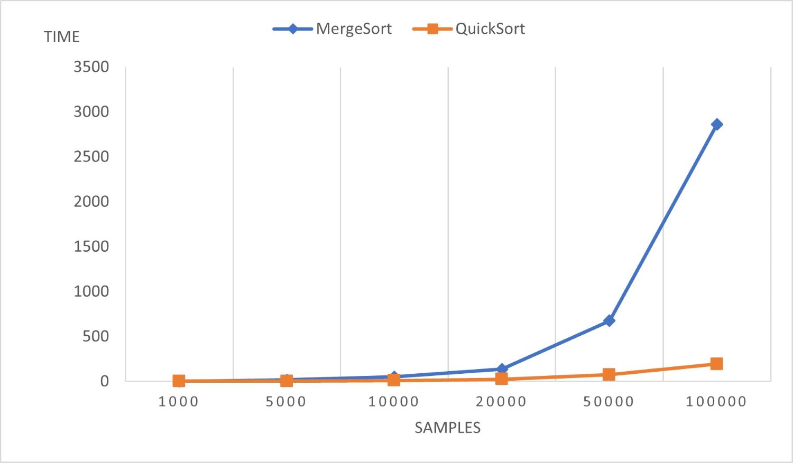

# Quick-Merge-Compare

Performance compare of Merge-Sort & Quick-Sort

## Implementation

- Generator.java : Random number generator
- MergeSort.java : Merge-Sort with static class, `MergeSort.sort(arr);`
- QuickSort.java : Quick-Sort with static class, `QuickSort.sort(arr);`
- Sort.java : 
  - Generate random number array samples (1000, 5000, 10000, 20000, 50000, 100000) 
  - Time Compare with `System.currentTimeMillis`

## Result

